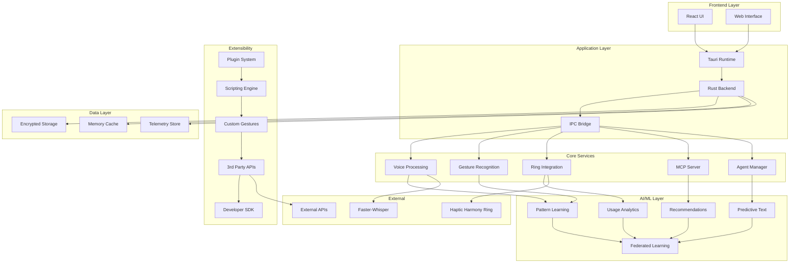
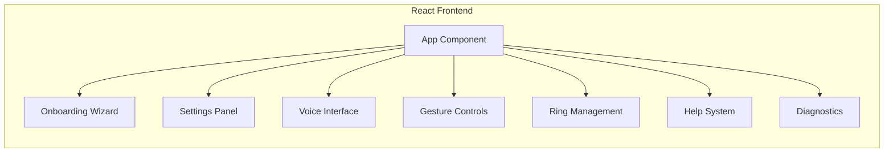
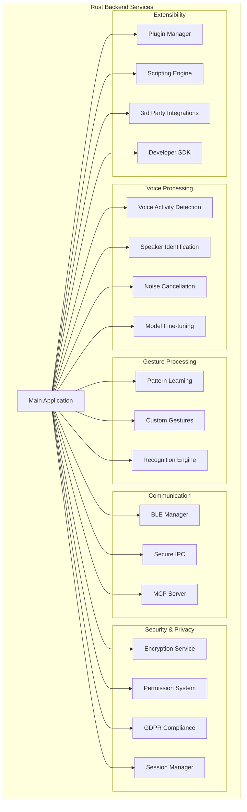
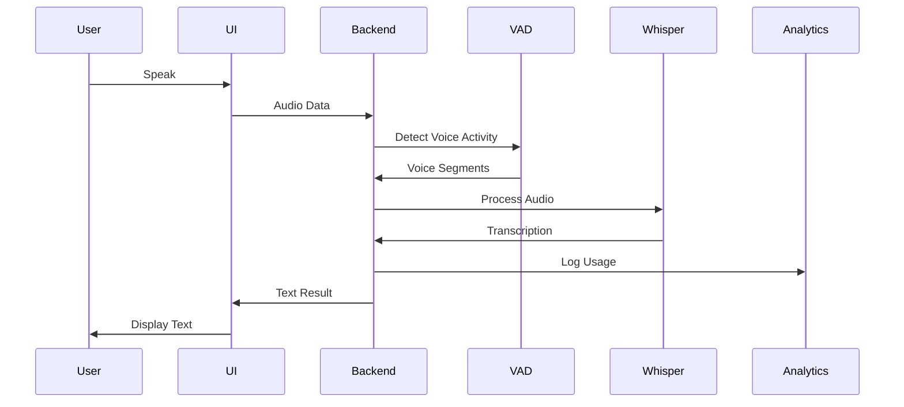
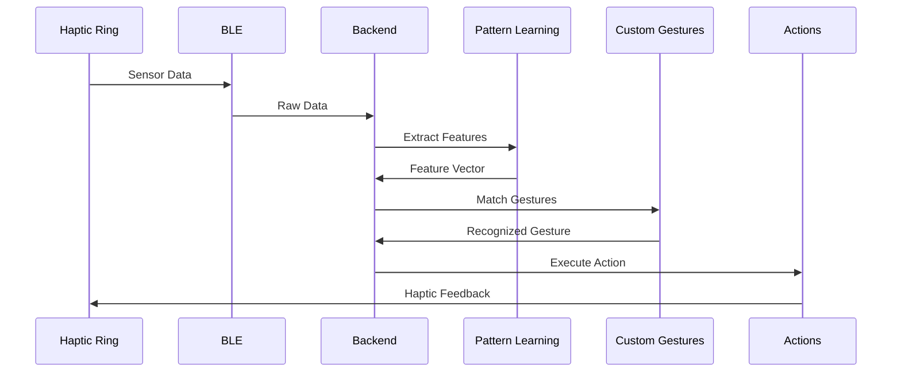
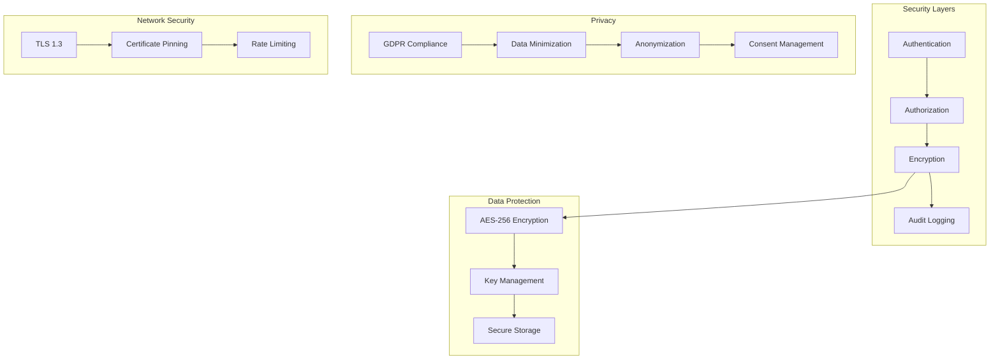
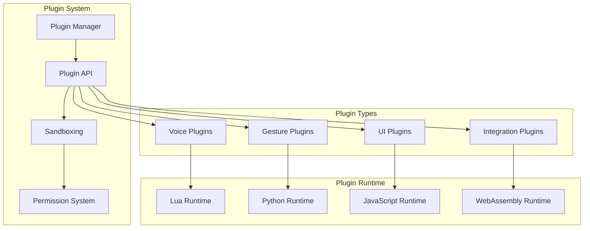
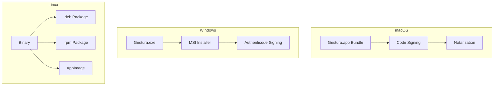
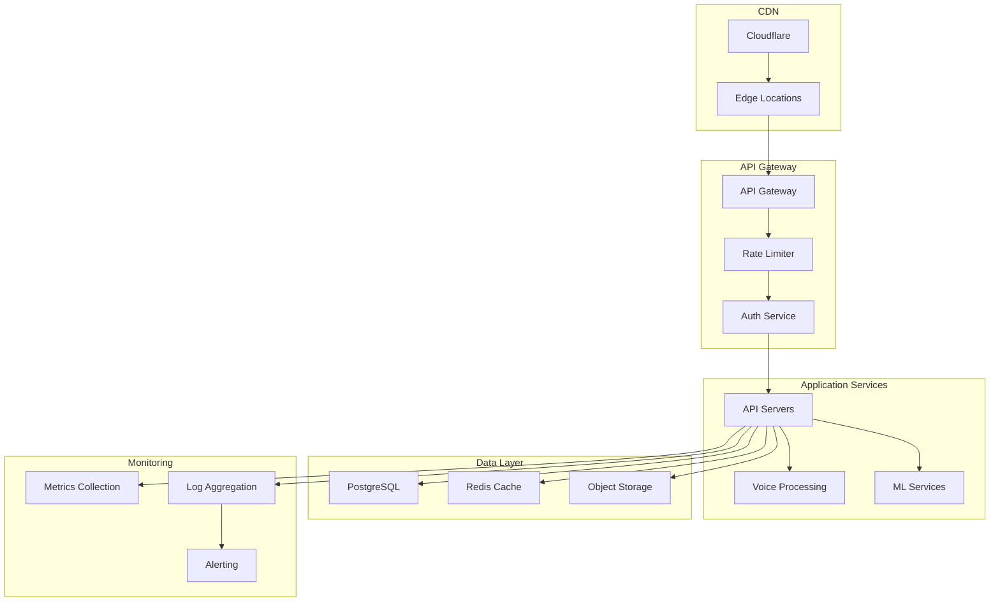

# Gestura.app Architecture

## System Overview

Gestura.app is a comprehensive voice and gesture control application built with modern technologies and designed for scalability, security, and extensibility.

## High-Level Architecture

## Component Architecture

### Frontend Components

### Backend Services

## Data Flow Architecture

### Voice Recognition Flow

### Gesture Recognition Flow

## Security Architecture

## Plugin Architecture

## Deployment Architecture

### Desktop Deployment

### Cloud Infrastructure

## Technology Stack

### Frontend
- **Framework**: React 18 with TypeScript
- **Build Tool**: Vite
- **Styling**: Tailwind CSS
- **State Management**: Zustand
- **UI Components**: Radix UI
- **Icons**: Lucide React

### Backend
- **Runtime**: Tauri (Rust + WebView)
- **Language**: Rust 1.75+
- **Async Runtime**: Tokio
- **Serialization**: Serde
- **HTTP Client**: Reqwest
- **Database**: SQLite with SQLx
- **Encryption**: AES-GCM, ChaCha20-Poly1305

### AI/ML
- **Speech Recognition**: Faster-Whisper
- **Feature Extraction**: Custom Rust implementations
- **Pattern Matching**: Cosine similarity, DTW
- **Privacy**: Differential Privacy, Federated Learning

### Communication
- **BLE**: Cross-platform BLE libraries
- **IPC**: Tauri's secure IPC
- **MCP**: JSON-RPC over STDIO
- **WebSockets**: For real-time communication

### Development
- **Build System**: Cargo + Tauri CLI
- **Testing**: Cargo test + Jest
- **CI/CD**: GitHub Actions
- **Documentation**: mdBook
- **Packaging**: Platform-specific tools

## Performance Characteristics

### Latency Targets
- **Voice Recognition**: < 500ms
- **Gesture Recognition**: < 100ms
- **Haptic Feedback**: < 50ms
- **UI Response**: < 16ms (60 FPS)

### Throughput
- **Voice Processing**: 10x real-time
- **Gesture Processing**: 1000 gestures/second
- **API Requests**: 10,000 requests/second
- **Plugin Execution**: 100 plugins/second

### Resource Usage
- **Memory**: < 200MB baseline
- **CPU**: < 5% idle, < 50% active
- **Storage**: < 100MB installation
- **Network**: < 1MB/hour telemetry

## Scalability Considerations

### Horizontal Scaling
- Stateless API services
- Load balancer distribution
- Database read replicas
- CDN for static assets

### Vertical Scaling
- Multi-core processing
- Memory-mapped files
- Async I/O operations
- Hardware acceleration

### Data Scaling
- Partitioned databases
- Compressed storage
- Efficient indexing
- Data lifecycle management

## Security Considerations

### Threat Model
- **Data Interception**: TLS encryption
- **Unauthorized Access**: Authentication + authorization
- **Data Tampering**: Digital signatures
- **Privacy Violations**: Data minimization + anonymization

### Security Controls
- **Encryption**: End-to-end encryption
- **Authentication**: Multi-factor authentication
- **Authorization**: Role-based access control
- **Auditing**: Comprehensive audit logs
- **Monitoring**: Real-time security monitoring

## Future Architecture

### Planned Enhancements
- **Edge Computing**: Local AI processing
- **Blockchain**: Decentralized identity
- **AR/VR**: Spatial gesture recognition
- **IoT Integration**: Smart home control
- **Multi-modal**: Combined voice + gesture + eye tracking
