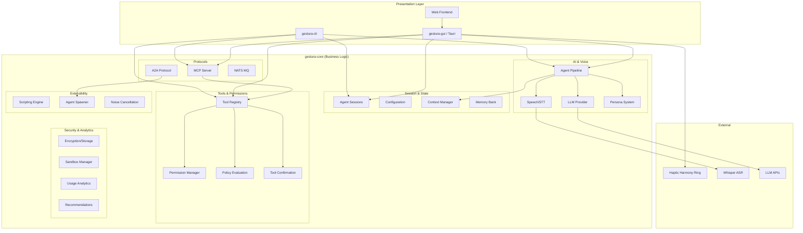
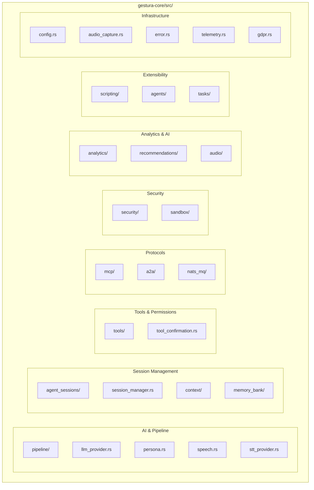
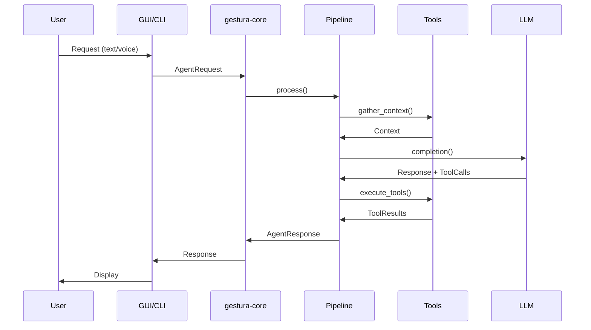
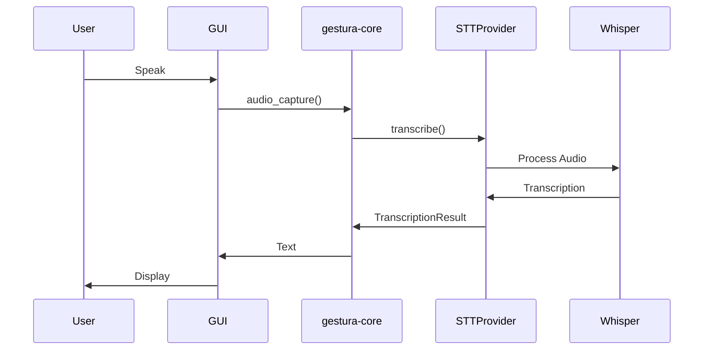
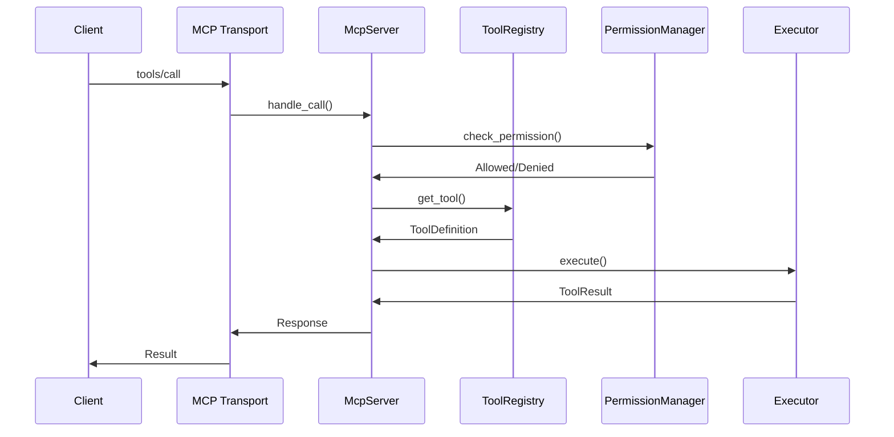
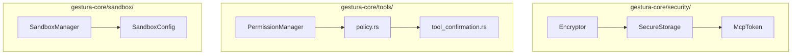
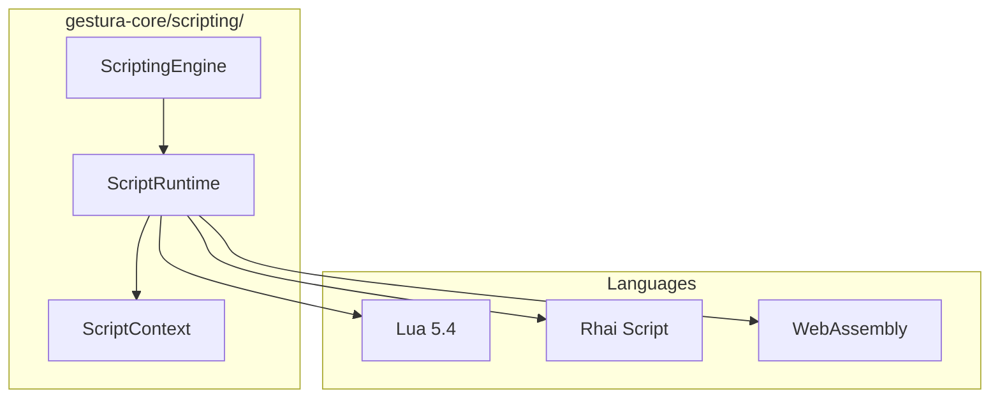
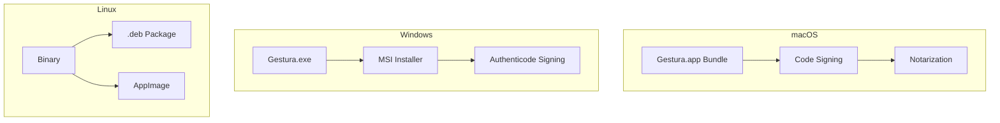

# Gestura.app Architecture

## System Overview

Gestura.app is a comprehensive voice and gesture control application built with modern technologies and designed for scalability, security, and extensibility. The architecture follows a **Core-First** pattern where all business logic resides in `gestura-core`, with CLI and GUI serving as thin presentation layers.

## Core-First Architecture

The codebase is organized as a Rust workspace with three crates:

```
gestura-app/
├── crates/
│   ├── gestura-core/     # Shared business logic (source of truth)
│   ├── gestura-cli/      # CLI binary (thin presentation layer)
│   └── gestura-gui/      # Tauri desktop app (thin presentation layer)
```

### Design Principles

1. **Single Source of Truth**: All business logic, data models, and algorithms live in `gestura-core`
2. **Thin Shells**: CLI and GUI are presentation layers that delegate to core
3. **Re-export Pattern**: GUI/CLI modules re-export core types for local usage
4. **Feature Gates**: Optional functionality controlled via Cargo features

## High-Level Architecture



## Crate Architecture

### gestura-core (Shared Library)

The core crate contains all business logic organized into modules:



### gestura-cli (CLI Binary)

Thin presentation layer with command routing:

```
gestura-cli/src/
├── main.rs              # Entry point with clap
├── tool_registry.rs     # CLI tool registration
└── commands/
    ├── agent/            # Interactive agent TUI
    ├── exec.rs          # One-shot execution
    ├── listen.rs        # Voice capture
    ├── session.rs       # Session management
    ├── mcp.rs           # MCP commands
    ├── a2a.rs           # A2A protocol
    ├── tools/           # System tools
    └── ...
```

### gestura-gui (Tauri Desktop App)

Thin Tauri shell with platform-specific integrations:

```
gestura-gui/src/
├── main.rs              # Tauri entry point
├── lib.rs               # Module exports
├── api.rs               # Tauri commands
├── window_manager.rs    # Window/session management
├── tray.rs              # System tray
├── hotkeys.rs           # Global shortcuts
├── permissions.rs       # OS permission checks
├── mcp_server.rs        # MCP transport adapter
└── ...                  # Thin re-export wrappers
```

## Module Details

### Core Modules (gestura-core)

| Module | Description | Key Types |
|--------|-------------|-----------|
| `pipeline/` | Agent request/response pipeline | `AgentRequest`, `AgentResponse`, `Pipeline` |
| `agent_sessions/` | Session persistence | `AgentSession`, `AgentSessionStore`, `FileAgentSessionStore` |
| `tools/` | Tool registry and execution | `ToolRegistry`, `ToolDefinition`, `PermissionManager` |
| `mcp/` | MCP server implementation | `McpServer`, `McpToolHandler`, `McpResourceHandler` |
| `a2a/` | Agent-to-Agent protocol | `A2AServer`, `A2AClient`, `AgentProfile` |
| `security/` | Encryption and secure storage | `SecureStorage`, `Encryptor`, `McpToken` |
| `secrets/` | Secret resolution for providers (secure storage, config fallbacks) | `SecretKey`, `SecretProvider`, `SecureStorageSecretProvider` |
| `sandbox/` | Sandboxed execution | `SandboxConfig`, `SandboxManager` |
| `speech.rs` | Speech and transcription types/utilities | `TranscriptionResult` |
| `stt_provider.rs` | STT provider selection + transcription providers | `SttProvider`, `select_provider_with_session_voice_config` |
| `scripting/` | Multi-language scripting | `ScriptingEngine`, `Script`, `ScriptContext` |
| `analytics/` | Usage tracking | `UsageAnalytics`, `AnalyticsInsights`, `PrivacyMode` |
| `recommendations/` | ML-based recommendations | `PersonalizedRecommendationEngine`, `Recommendation` |
| `audio/` | Noise cancellation | `NoiseCancellationProcessor`, `NoiseCancellationConfig` |
| `agents/` | Agent orchestration | `AgentEnvelope`, `AgentSpawner`, `OrchestratorToolCall` |
| `nats_mq/` | NATS messaging | `Connection`, `Publisher`, `Subscriber` |

### Memory Architecture

- **Short-term memory** lives in `agent_sessions/` as session-scoped working memory (resources, decisions, blockers, timeline, next actions).
- **Long-term/shared memory** lives in `memory_bank/` as typed records with explicit `memory_type`, `scope`, provenance, tags, and confidence.
- **Pipeline retrieval** injects both short-term and long-term memory into prompt context through `ResolvedContext.memory_sections`, with prompt-budget caps.
- **Delegated work** can promote durable handoff/blocker records and mirror those events into task metadata for lifecycle tracking.

### GUI Thin Wrappers

After the Core-First migration, GUI modules are thin re-export wrappers:

```rust
// Example: crates/gestura-gui/src/security.rs (18 lines)
//! Security primitives - thin wrapper over gestura_core::security
pub use gestura_core::security::{
    Encryptor, McpToken, SecureStorage, create_secure_storage,
};
```

Key shims in this migration include:

- `crates/gestura-gui/src/gdpr.rs` → re-exports `gestura_core::gdpr::*`
- `crates/gestura-gui/src/audio_capture.rs` → re-exports core audio types and provides a tiny
  adapter to apply GUI config defaults (selected input device) before delegating to core.

## Data Flow Architecture

### Agent Pipeline Flow



#### Adapter responsibilities (CLI/GUI) vs core responsibilities

In a Core-First architecture, the presentation layers (CLI/GUI) should *construct requests* and
*render results*, while `gestura-core` is the sole owner of execution policy.

- **CLI/GUI (thin adapter)**
  - Build an `AgentRequest` and tag it with `RequestSource` (e.g. `CliTui`, `GuiText`).
  - For flows that must not execute tools (e.g. legacy single-shot UX or background event handlers),
    set `tools_enabled=false` on the request.
  - Avoid direct provider selection/calls in adapters; route all LLM/tool work through the core pipeline.

- **gestura-core (business logic)**
  - Runs request analysis and selects providers/tools.
  - Enforces tool policy/confirmation.
  - Applies tool gating using:
    - pipeline config (`PipelineConfig.enable_tools`)
    - per-request override (`AgentRequest.metadata.tools_enabled`)
    - request analysis (`analysis.needs_tools`)

This separation keeps UX code (GUI/CLI) simple, and ensures that security policy and tool execution
cannot drift between adapters.

### Voice Recognition Flow



**Ownership and precedence (Core-First):**

- `gestura-core` owns STT provider selection, session override precedence, secret/key resolution, and error semantics.
- `gestura-gui` is a thin adapter that:
  - records audio
  - passes the active session's voice overrides (if any)
  - wires secure storage into core via `SecureStorageSecretProvider`

**OpenAI STT API key resolution (high-level):**

1. `config.voice.openai_api_key`
2. secure storage secret `VoiceOpenAi`
3. secure storage secret `OpenAi`
4. legacy `config.llm.openai.api_key` (backwards compatibility)

### MCP Tool Execution Flow



## Security Architecture

### Core Security Model



### Permission System

| Level | Description | Example Actions |
|-------|-------------|-----------------|
| `ReadOnly` | Read files, view context | `file_read`, `git_status` |
| `WriteLocal` | Write to allowed paths | `file_write`, `file_edit` |
| `Execute` | Run local commands | `shell_exec`, `script_run` |
| `Network` | External API calls | `web_fetch`, `api_call` |
| `Admin` | Full system access | `install_package`, `root_exec` |

### Privacy Modes (Analytics)

```rust
pub enum PrivacyMode {
    Full,       // Collect all anonymous analytics
    Limited,    // Only essential metrics
    Anonymous,  // Fully anonymized data
    Disabled,   // No data collection
}
```

## Extensibility Architecture

### Scripting Engine



### Plugin Sandboxing

All scripts execute in sandboxed environments with:
- **Resource limits**: CPU time, memory, file handles
- **Capability restrictions**: No network without permission
- **Isolation**: Separate execution contexts

## Deployment Architecture

### Desktop Deployment



### Build Outputs

| Crate | Output | Description |
|-------|--------|-------------|
| `gestura-core` | `libgestura_core.rlib` | Shared library |
| `gestura-cli` | `gestura-cli` binary | Command-line tool |
| `gestura-gui` | Platform bundle | Tauri desktop app |

## Technology Stack

### Core (Rust)
- **Edition**: Rust 2024
- **Async Runtime**: Tokio 1.x
- **Serialization**: Serde + serde_json
- **HTTP Client**: Reqwest
- **Error Handling**: thiserror + anyhow
- **Encryption**: ring, aes-gcm, chacha20poly1305
- **Secure Storage**: keyring (OS keychain)

### Protocols
- **MCP**: Model Context Protocol 2025-11-25 (JSON-RPC 2.0)
- **A2A**: Google Agent2Agent Protocol
- **NATS**: Message queue for event-driven architecture

### GUI (Tauri v2)
- **Framework**: Tauri 2.x with WebView
- **Frontend**: HTML/CSS/JavaScript
- **Styling**: Tailwind CSS
- **IPC**: Tauri Commands

### CLI
- **Parser**: Clap 4.x with derive
- **TUI**: Ratatui for interactive agent
- **Completions**: Shell completion generation

### AI/ML
- **Speech Recognition**: Whisper (faster-whisper)
- **LLM Providers**: OpenAI, Anthropic, local
- **Noise Cancellation**: Spectral subtraction (DFT/IDFT)

### Development
- **Build**: Cargo (workspace), Tauri CLI
- **Testing**: Cargo test (462+ tests)
- **Linting**: Clippy with -D warnings
- **CI/CD**: GitHub Actions

## Quality Gates

All changes must pass:
```bash
cargo fmt -- --check
cargo clippy --workspace --all-targets --all-features -- -D warnings
cargo test --workspace --all-features
```

## Performance Characteristics

### Latency Targets
- **Tool Execution**: < 100ms local, < 2s network
- **Voice Recognition**: < 500ms
- **UI Response**: < 16ms (60 FPS)
- **MCP Round-trip**: < 50ms local

### Resource Usage
- **Memory**: < 200MB baseline
- **CPU**: < 5% idle, < 30% active
- **Storage**: < 100MB installation
- **Disk I/O**: Async, non-blocking

## Core-First Development Guidelines

### Adding New Features

1. **Implement in Core**: Add business logic to `gestura-core`
2. **Export Types**: Add re-exports to `lib.rs`
3. **CLI Integration**: Add command to `gestura-cli/src/commands/`
4. **GUI Integration**: Create thin wrapper in `gestura-gui/src/`

### Module Organization

```rust
// gestura-core/src/new_feature/mod.rs
pub mod types;
pub mod implementation;

pub use types::*;
pub use implementation::*;

// gestura-gui/src/new_feature.rs
//! New feature - thin wrapper over gestura_core::new_feature
pub use gestura_core::new_feature::*;
```

### Error Handling

```rust
// Use thiserror for error types
#[derive(Debug, thiserror::Error)]
pub enum NewFeatureError {
    #[error("Configuration error: {0}")]
    Config(String),
    #[error("IO error: {0}")]
    Io(#[from] std::io::Error),
}
```
