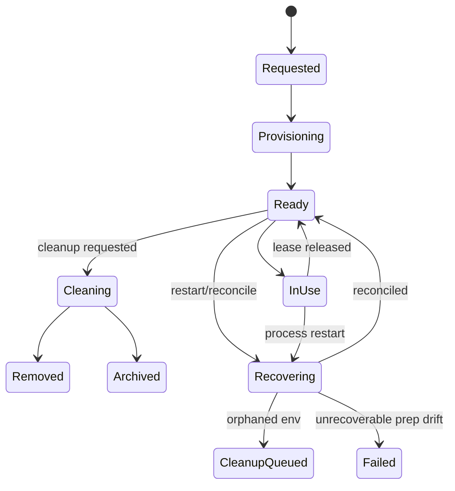

# Gestura.app Developer Guide

## Table of Contents

1. [Getting Started](#getting-started)
2. [Development Environment](#development-environment)
3. [Core-First Architecture](#core-first-architecture)
4. [Adding New Features](#adding-new-features)
5. [Scripting](#scripting)
6. [API Integration](#api-integration)
7. [Testing](#testing)
8. [Deployment](#deployment)

## Getting Started

Welcome to Gestura.app development! This guide covers the Core-First architecture and how to contribute to the codebase.

### Prerequisites

- **Rust 2024 Edition**: Install via rustup
- **Tauri CLI**: For GUI development
- **Development Tools**: VS Code with rust-analyzer, terminal, Git

### Quick Start

```bash
# Clone the repository
git clone https://github.com/gestura-ai/gestura-app.git
cd gestura-app

# Install Tauri CLI
cargo install tauri-cli

# Run quality gates
cargo fmt
cargo clippy --workspace --all-targets --all-features -- -D warnings
cargo test --workspace --all-features

# Development
cargo tauri dev  # GUI development
cargo run -p gestura-cli -- --help  # CLI
```

## Development Environment

### Workspace Navigation

Treat the workspace as three layers:

- `gestura-core` — stable public facade and cross-domain integration points
- `gestura-core-*` — focused domain crates that own most business logic
- `gestura-cli` / `gestura-gui` — thin presentation layers and platform wiring

For the canonical crate/module map, prefer generated Rustdoc:

```bash
cargo doc --workspace --no-deps
```

### Build Commands

```bash
# Format code
cargo fmt

# Lint with strict warnings
cargo clippy --workspace --all-targets --all-features -- -D warnings

# Run all tests
cargo test --workspace --all-features

# Build all crates
cargo build --workspace

# Release build
cargo build --workspace --release

# GUI development
cargo tauri dev

# CLI only
cargo run -p gestura-cli -- agent
```

## Core-First Architecture

For the canonical crate and module reference, prefer generated Rustdoc via:

```bash
cargo doc --workspace --no-deps
```

Use this guide for contributor workflow and operational development practices;
use crate/module Rustdoc for the source-of-truth architecture and API surface.

### CLI Interactive Slash UX Contract

The interactive `gestura agent` surfaces now use a **shared slash-command catalog** plus a **managed root shell** model.

- Keep shared interactive slash metadata in `crates/gestura-cli/src/commands/agent/catalog.rs`.
- Treat **direct commands** and **root shells** differently:
  - direct commands execute immediately (`/help`, `/clear`, `/save`, `/history`, `/summarize`, `/listen`, `/voice`, `/init`)
  - root shells open an interactive browser/shell when used without args, but explicit subcommands still execute directly (`/config`, `/context`, `/a2a`, `/privacy`, `/agent`, `/workflow`, `/mcp`, `/tasks`, `/hooks`, `/memory`, `/session`, `/knowledge`, `/permissions`, `/tools`, `/theme`, `/model`, `/device`)
- When you add or rename an interactive slash command, update all of these together:
  - shared catalog metadata
  - TUI command suggestions/help
  - TUI/basic-mode routing
  - focused regression tests for routing/discoverability

Do not let help text, command suggestions, and actual dispatch drift apart again. If a root command is advertised as a managed shell, bare usage should open a navigable interface and the documented explicit subcommands should remain executable.

### Design Principles

1. **Single Source of Truth**: Business logic lives in `gestura-core` and the owning `gestura-core-*` domain crates
2. **Thin Presentation Layers**: CLI and GUI delegate to core
3. **Re-export Pattern**: `gestura-core` exposes stable public paths over domain crates
4. **Feature Gates**: Optional functionality via Cargo features

### Ownership Rule of Thumb

- If a feature belongs to one domain, put it in the owning `gestura-core-*` crate.
- If it defines a stable public entry point or cross-domain orchestration, wire it through `gestura-core`.
- If it is mostly UI, transport, or platform integration, keep it in `gestura-cli` or `gestura-gui`.

### Workflow Approval Gates

Gestura workflow approvals are now policy-backed gates, not loose UI flags. The source of truth lives in `gestura_core::orchestrator` and is persisted with each supervisor run/task record.

#### Gate scopes

- `pre_execution` — blocks work before agent execution starts
- `review` — blocks completion until reviewer/supervisor approval is recorded
- `test_validation` — blocks completion until tester/supervisor validation is recorded

#### Allowed actors by default

- `pre_execution`: `supervisor`, `user`
- `review`: `reviewer`, `supervisor`
- `test_validation`: `tester`, `supervisor`

Delegated tasks derive these policies from `approval_required`, `reviewer_required`, and `test_required`. Do not hard-code ad hoc approval checks in CLI/GUI handlers; always route through core orchestrator methods so authorization, audit history, and retry semantics stay consistent.

#### Operator surfaces

- GUI: workflow panel shows active gate scope, allowed actor kinds, request provenance, and latest decision history
- Tauri API: `approve_workflow_task` / `reject_workflow_task` take a structured `ApprovalActor`
- CLI slash commands:
  - `/task approvals`
  - `/task approve <workflow_task_id> [--actor <supervisor|reviewer|tester|user>] [note...]`
  - `/task reject <workflow_task_id> [--actor <supervisor|reviewer|tester|user>] [note...]`

Approval CLI commands operate on delegated workflow task IDs (full ID or unique prefix), not the local task-manager UUID alone.

#### Common failure modes

- **Unauthorized actor**: the actor kind does not match the gate policy for the active scope
- **No active gate**: the task is not currently in `pending_approval`, `review_pending`, or `test_pending`
- **Workspace mismatch**: CLI approval commands need the current session workspace so they can load persisted supervisor runs
- **Ambiguous task prefix**: the supplied workflow task prefix matches multiple pending gates

When adding new approval-adjacent features, update the policy in core first, expose the resulting state through stable API models, and only then add controls in CLI/GUI layers.

### Workflow Collaboration Threads

Structured team messaging is now a first-class collaboration layer, not a loose log of status strings. The source of truth lives in `gestura_core::orchestrator` and is persisted inside each supervisor run/task record alongside approvals and execution state.

#### Collaboration model

- `TeamMessage` stores the durable message record, sender/recipient, thread/reply links, unread state, artifact/result references, and archive metadata
- `TeamActionRequest` stores the actionable request attached to a message (approval, review, clarification, blocker escalation, handoff, test validation)
- `TeamThread` is the synthesized inbox/view model produced from persisted messages, with status, unread counts, latest actionable request, and participant summaries

#### State transition rules

- approval, review, and test gates auto-create actionable collaboration threads
- thread actions (`acknowledged`, `resolved`, `needs_revision`, `cancelled`) must flow through orchestrator helpers, not UI-local mutations
- blocker threads are coupled to task visibility: opening a blocker can mark the task `blocked`, and resolving the blocker clears the matching blocked reason
- resolved threads can be archived; archived threads are hidden from default thread listings but remain queryable with explicit include-archived paths

#### Operator surfaces

- GUI workflow panel shows threaded collaboration cards with reply, acknowledge, resolve, revise, escalate, and archive controls
- Tauri commands expose thread listing/filtering plus structured thread/message actions:
  - `send_workflow_collaboration_message`
  - `list_workflow_threads`
  - `update_workflow_thread_action`
  - `archive_workflow_thread`
- CLI slash commands expose the same collaboration controls for the active workflow scope:
  - `/task threads [--archived]`
  - `/task message <run_id|task_id> <kind> <note...>`
  - `/task thread <ack|resolve|revise|archive|escalate> <thread_id> [note...]`

#### Contributor guardrails

- keep lifecycle logic in core (`send_team_message_draft`, `update_team_thread_action`, `archive_team_thread`) so GUI/CLI cannot drift from persisted behavior
- when adding new collaboration kinds, update the draft/request/thread types and all stable surfaces together (Rust, Tauri, TypeScript, CLI help, tests)
- preserve backward-compatible deserialization defaults for older persisted messages that may lack thread/archive/action metadata

### Shared Supervisor/Subagent Cognition

Phase 9 shared cognition builds on collaboration threads, but it is **not** just another inbox view. The source of truth remains `gestura_core::orchestrator`, where collaboration messages can be promoted into durable run-scoped cognition notes and mirrored into the memory bank under the `shared_cognition` category.

#### Model

- `SupervisorRun.shared_cognition` stores the durable in-run note log with authorship, timestamps, confidence, source message linkage, task/directive provenance, and retrieval tags
- collaboration messages map into bounded note kinds such as discovery, blocker, hypothesis, steering, decision, and handoff
- shared-cognition memory bank entries use the stable `shared_cognition` category plus workflow-run tags so prompt enrichment can retrieve only the scoped notes that matter

#### Operator surfaces

- GUI workflow panel renders run-level shared cognition notes next to collaboration threads so supervisors can see steering, blockers, confidence, and ownership mid-task
- GUI memory console overview surfaces `shared_cognition` category counts, searchable quick filters, and entry metadata for task/directive/agent/confidence/tag inspection
- CLI `/task tree` includes compact shared-cognition summaries per run so operators can spot active steering or unresolved hypotheses without opening raw JSON

#### Contributor guardrails

- keep the message → shared-cognition promotion rules in core; do not re-implement classification heuristics in CLI/GUI adapters
- preserve serde defaults on `SupervisorRun.shared_cognition` and related note fields so older persisted runs remain readable
- keep prompt enrichment bounded: scope by task/directive/tags and cap shared-cognition injection to a small fixed number of high-signal notes
- when you change note fields or categories, update core tests, prompt-enrichment tests, benchmark fixtures, CLI/GUI surfaces, and memory console documentation together

### Bounded Hierarchical Supervision

Iteration 4 adds direct child-supervisor runs for one additional layer of delegation. This is intentionally **bounded**: root supervisor runs may create child supervisor runs, but child runs may not create grandchildren.

#### Hierarchy model

- `SupervisorRun.parent_run` stores the durable parent reference for child runs
- `SupervisorRun.child_runs` stores synthesized direct-child summaries on the parent run
- `SupervisorRun.inherited_policy` stores approval/review/test defaults, execution mode, workspace inheritance, memory tags, and constraint notes for tasks created inside that run
- `SupervisorRun.hierarchy_summary` stores roll-up status, direct child counts, descendant task counts, and child attention/blocker signals

#### Lifecycle rules

- create child runs only through `AgentOrchestrator::create_child_supervisor_run`
- enforce `MAX_CHILD_SUPERVISOR_DEPTH` in core, not in adapters
- when a child run changes, refresh the parent summary/status before notifying Tauri/CLI observers
- treat parent run status as a roll-up over both local tasks and direct child run state

#### Operator surfaces

- GUI workflow panel renders root and child runs in one ordered hierarchy, including child summaries and a root-only “Create child supervisor” form
- Tauri exposes `create_child_supervisor_run` with the core-owned `ChildSupervisorRunRequest` payload
- CLI exposes:
  - `/task tree`
  - `/task child-run <parent_run_id> <lead_agent_id> --objective <text...> ...`

#### Contributor guardrails

- keep hierarchy persistence/backfill serde-safe: new run fields must deserialize from older persisted runs with sensible defaults
- do not let GUI/CLI invent their own parent-child roll-up logic; consume the run model and core summaries instead
- if you extend depth or inheritance semantics later, update roll-up tests, CLI tree rendering, workflow panel types, and docs together

### Workflow Execution Environments and Recovery

Iteration 1 of Phase 8 promotes execution environments from metadata into a durable subsystem. The source of truth lives in `gestura_core::orchestrator` (`environment.rs`, `recovery.rs`, `persistence.rs`) and is mirrored through Tauri/frontend surfaces without adapter-local lifecycle logic.

#### Persistence layout

- Supervisor runs persist to `.gestura/orchestrator/<session>/runs/<run-id>.json`
- Environment records persist to `.gestura/orchestrator/<session>/environments/<environment-id>.json`
- Isolated workspaces are created under `.gestura/environments/<session>/<run>/<agent>/<task>`
- Git worktrees are created under `.gestura/worktrees/<session>/<run>/<agent>/<task>` with branches named `gestura/<session>/<run>/<agent>/<task>`

#### Lifecycle state model



#### Operator expectations

- `shared_workspace`
  - executes directly in the user workspace
  - is **never** auto-deleted by cleanup operations
  - if missing at reconciliation time, the owning task is blocked and requires operator attention
- `isolated_workspace`
  - creates a dedicated directory inside `.gestura/environments/...`
  - defaults to `remove_when_clean_otherwise_archive`
  - missing isolated environments are marked `pending` with `recreate_missing_environment`, and `retry_environment_preparation` is the intended repair path
- `git_worktree`
  - requires the workspace root to be a valid git repository
  - creates/validates a real registered worktree, not a metadata placeholder
  - dirty worktrees archive on cleanup; drifted/unregistered worktrees block the owning task for operator review
- orphaned environments are marked `queue_cleanup` during reconciliation; they are surfaced for inspection instead of being silently destroyed

#### Restart/recovery rules

- Any task persisted as `running` is converted to `blocked` with `execution interrupted during restart`
- Active environment leases are released during reconciliation and surfaced as `release_stale_lease`
- Shared-workspace loss and worktree drift require operator attention; isolated-workspace loss is eligible for recreation
- Recovery must be **idempotent**: repeated `reconcile_orchestrator_state` calls should converge on the same durable state, not stack duplicate blocked reasons or mutate unrelated runs

#### Stable operator/API surfaces

- Core: `list_environments`, `get_environment`, `retry_environment_preparation`, `cleanup_environment`, `reconcile_orchestrator_state`
- Tauri: `list_workflow_environments`, `get_workflow_environment`, `retry_workflow_environment`, `cleanup_workflow_environment`, `reconcile_workflow_state`
- GUI: Workflows panel → **Environments** tab with state/health/recovery/cleanup summaries plus **Reconcile**, **Retry prep**, and **Cleanup** controls

#### Contributor guardrails

- keep lifecycle decisions in core; GUI/CLI may trigger actions but must not infer cleanup/recovery outcomes locally
- when adding new environment fields, update Rust models, Tauri command docs, TypeScript wrappers, workflow panel rendering, and focused tests together
- verify both creation and restart paths: add/adjust tests in `environment.rs`, `recovery.rs`, and relevant GUI workflow tests before widening validation scope

### Phase 9 Agent-loop Maturity Program

The next maturity step after Phase 8 is tracked in `docs/AGENT_LOOP_MATURITY_PHASE9.md`.

Use that document as the planning/execution contract for:

- resumable delegated execution
- local delegated telemetry/control parity
- outcome-linked ERL and bounded corrective re-execution
- memory governance and retrieval quality
- shared supervisor/subagent working memory

Contributor rules for Phase 9 work:

- land replay/resume features behind explicit rollout flags first
- treat replay-safety classification as a core-owned contract, not adapter logic
- update benchmark fixtures in `crates/gestura-core-pipeline/testdata/phase9/benchmark_scenarios.json` whenever behavior or acceptance criteria changes
- do not claim a Phase 9 slice complete without both focused fixture-driven tests and workspace-level regression validation

### Re-export Pattern

The facade and presentation layers should stay thin over the owning core domain:

```rust
// crates/gestura-gui/src/security.rs (18 lines)
//! Security primitives - thin wrapper over gestura_core::security
pub use gestura_core::security::{
    Encryptor, McpToken, SecureStorage, create_secure_storage,
};
```

```rust
// crates/gestura-gui/src/a2a.rs (7 lines)
//! A2A protocol - thin wrapper over gestura_core::a2a
pub use gestura_core::a2a::*;
```

## Adding New Features

### Step 1: Implement in the Owning Domain Crate

Add business logic to the relevant `gestura-core-*` crate first:

```rust
// crates/gestura-core-new-feature/src/lib.rs
pub mod types;
mod implementation;

pub use types::*;
pub use implementation::*;
```

```rust
// crates/gestura-core-new-feature/src/types.rs
use serde::{Deserialize, Serialize};

#[derive(Debug, Clone, Serialize, Deserialize)]
pub struct NewFeatureConfig {
    pub enabled: bool,
    pub option: String,
}

#[derive(Debug, Clone)]
pub struct NewFeature {
    config: NewFeatureConfig,
}

impl NewFeature {
    pub fn new(config: NewFeatureConfig) -> Self {
        Self { config }
    }

    pub async fn execute(&self, input: &str) -> Result<String, NewFeatureError> {
        // Implementation
        Ok(format!("Processed: {}", input))
    }
}
```

### Step 2: Re-export Through `gestura-core`

```rust
// crates/gestura-core/src/lib.rs
pub mod new_feature {
    pub use gestura_core_new_feature::*;
}
```

### Step 3: Add Presentation-Layer Wiring Only If Needed

```rust
// crates/gestura-gui/src/new_feature.rs
//! New feature - thin wrapper over gestura_core::new_feature
pub use gestura_core::new_feature::*;
```

### Step 4: Add CLI Command

```rust
// crates/gestura-cli/src/commands/new_feature.rs
use clap::Args;
use gestura_core::new_feature::*;

#[derive(Args)]
pub struct NewFeatureArgs {
    /// Input to process
    #[arg(short, long)]
    pub input: String,
}

pub async fn run(args: NewFeatureArgs) -> anyhow::Result<()> {
    let config = NewFeatureConfig::default();
    let feature = NewFeature::new(config);
    let result = feature.execute(&args.input).await?;
    println!("{}", result);
    Ok(())
}
```

### Error Handling

Use `thiserror` for error types:

```rust
// crates/gestura-core/src/new_feature/mod.rs
use thiserror::Error;

#[derive(Debug, Error)]
pub enum NewFeatureError {
    #[error("Configuration error: {0}")]
    Config(String),

    #[error("Execution error: {0}")]
    Execution(String),

    #[error("IO error: {0}")]
    Io(#[from] std::io::Error),
}
```

### Adding Tests

```rust
// crates/gestura-core/src/new_feature/mod.rs
#[cfg(test)]
mod tests {
    use super::*;

    #[tokio::test]
    async fn test_new_feature() {
        let config = NewFeatureConfig {
            enabled: true,
            option: "test".to_string(),
        };
        let feature = NewFeature::new(config);
        let result = feature.execute("input").await.unwrap();
        assert!(result.contains("Processed"));
    }
}
```

## Permission System

### Permission Levels

| Level | Description | Example Actions |
|-------|-------------|-----------------|
| `ReadOnly` | Read files, view context | `file_read`, `git_status` |
| `WriteLocal` | Write to allowed paths | `file_write`, `file_edit` |
| `Execute` | Run local commands | `shell_exec`, `script_run` |
| `Network` | External API calls | `web_fetch`, `api_call` |
| `Admin` | Full system access | `install_package`, `root_exec` |

### Checking Permissions

```rust
use gestura_core::tools::{PermissionManager, PermissionLevel};

let perms = PermissionManager::new(config);

// Check if action is allowed
if perms.is_action_allowed(&request) {
    // Execute the action
}

// Check if confirmation is required
if perms.requires_confirmation(&tool_call) {
    // Prompt user for confirmation
}
```

## Scripting Engine

The scripting domain lives in `gestura-core-scripting` and is surfaced through
`gestura_core::scripting::*` in generated Rustdoc.

Use this guide for workflow-level expectations; use generated docs for the exact
API surface.

### Script Types

| Language | Engine | Features |
|----------|--------|----------|
| Lua | mlua | Lightweight, fast startup |
| Python | PyO3 | ML libraries, data processing |
| JavaScript | deno_core | Async, web APIs |

### Creating a Script

```rust
use gestura_core::scripting::{ScriptContext, ScriptPermission, ScriptingEngine};

// Load and execute a script
let engine = ScriptingEngine::new(script_directory);
engine.initialize().await?;
let script_id = engine.load_script(&script_path).await?;

let context = ScriptContext {
    script_id: script_id.clone(),
    user_id: "user-1".into(),
    session_id: "session-1".into(),
    variables: std::collections::HashMap::new(),
    permissions: vec![ScriptPermission::Network("api.example.com".into())],
    execution_timeout: std::time::Duration::from_secs(30),
};

let result = engine.execute_script(&script_id, context).await?;
```

### Script Permissions

Treat the exact scripting API surface as generated-doc material.

For contributor work, the important rules are:

- request only the permissions a script actually needs
- keep execution timeouts explicit
- document triggers and side effects clearly
- prefer generated Rustdoc for exact types, enums, and runtime methods

## MCP Integration

### MCP Server (Core Implementation)

The MCP protocol domain lives in `gestura-core-mcp` and is surfaced through
`gestura_core::mcp::*`.

Use generated Rustdoc for the protocol/API surface and `gestura mcp --help` for
the CLI contract.

Built-in tool implementation details now belong in generated docs for:

- `gestura_core::tools::*`
- `gestura-core-tools`
- `gestura_core::mcp::*`
- `gestura-core-mcp`

### MCP CLI Commands

```bash
gestura mcp list
gestura mcp status
gestura mcp tools
gestura mcp capabilities
```

## Testing

### Running Tests

```bash
# Run all workspace tests
cargo test --workspace --all-features

# Run specific crate tests
cargo test -p gestura-core
cargo test -p gestura-cli
cargo test -p gestura-gui

# Run with output
cargo test --workspace -- --nocapture

# Run specific test
cargo test test_session_persistence
```

### Writing Tests

```rust
// crates/gestura-core/src/agent_sessions/mod.rs
#[cfg(test)]
mod tests {
    use super::*;

    #[tokio::test]
    async fn test_session_persistence() {
        let store = SessionStore::new_temp().unwrap();

        let session = AgentSession::new("test-session");
        store.save(&session).await.unwrap();

        let loaded = store.load("test-session").await.unwrap();
        assert_eq!(loaded.id, session.id);
    }

    #[tokio::test]
    async fn test_message_append() {
        let mut session = AgentSession::new("test");

        session.add_message(Message {
            role: Role::User,
            content: "Hello".to_string(),
            timestamp: Utc::now(),
        });

        assert_eq!(session.messages.len(), 1);
    }
}
```

### Integration Tests

```rust
// crates/gestura-gui/tests/integration_tests.rs
#[tokio::test]
async fn test_pipeline_integration() {
    let config = Config::default();
    let pipeline = Pipeline::new(config).await.unwrap();

    let request = AgentRequest {
        content: "Hello".to_string(),
        source: RequestSource::Cli,
        session_id: None,
    };

    let response = pipeline.process(request).await.unwrap();
    assert!(!response.content.is_empty());
}
```

## Deployment

### Building for Production

```bash
# Quality gates (required)
cargo fmt
cargo clippy --workspace --all-targets --all-features -- -D warnings
cargo test --workspace --all-features

# Release build
cargo build --workspace --release

# GUI packaging
cargo tauri build
```

### Build Outputs

| Platform | Output | Location |
|----------|--------|----------|
| macOS | .dmg, .app | `target/release/bundle/dmg/` |
| Windows | .msi, .exe | `target/release/bundle/msi/` |
| Linux | .deb, .AppImage | `target/release/bundle/deb/` |

### CI/CD Pipeline

```yaml
# .github/workflows/build.yml
name: Build and Test

on: [push, pull_request]

jobs:
  quality-gates:
    runs-on: ubuntu-latest
    steps:
      - uses: actions/checkout@v4
      - uses: dtolnay/rust-toolchain@stable
      - run: cargo fmt -- --check
      - run: cargo clippy --workspace --all-targets --all-features -- -D warnings
      - run: cargo test --workspace --all-features

  build:
    needs: quality-gates
    strategy:
      matrix:
        os: [ubuntu-latest, windows-latest, macos-latest]
    runs-on: ${{ matrix.os }}
    steps:
      - uses: actions/checkout@v4
      - uses: dtolnay/rust-toolchain@stable
      - run: cargo build --workspace --release
      - uses: tauri-apps/tauri-action@v0
        env:
          GITHUB_TOKEN: ${{ secrets.GITHUB_TOKEN }}
```

---

## Resources

### Documentation
- **Generated Rustdoc**: Run `cargo doc --workspace --no-deps`
- **Architecture Transition Guide**: See `docs/ARCHITECTURE.md`
- **API Routing Guide**: See `docs/API.md`
- **Code Organization Map**: See `docs/CODE_ORGANIZATION.md`

### Community
- **GitHub**: https://github.com/gestura-ai/gestura-app
- **Issues**: https://github.com/gestura-ai/gestura-app/issues
- **Discussions**: https://github.com/gestura-ai/gestura-app/discussions

---

*Happy coding! Build with the Core-First architecture pattern.*
