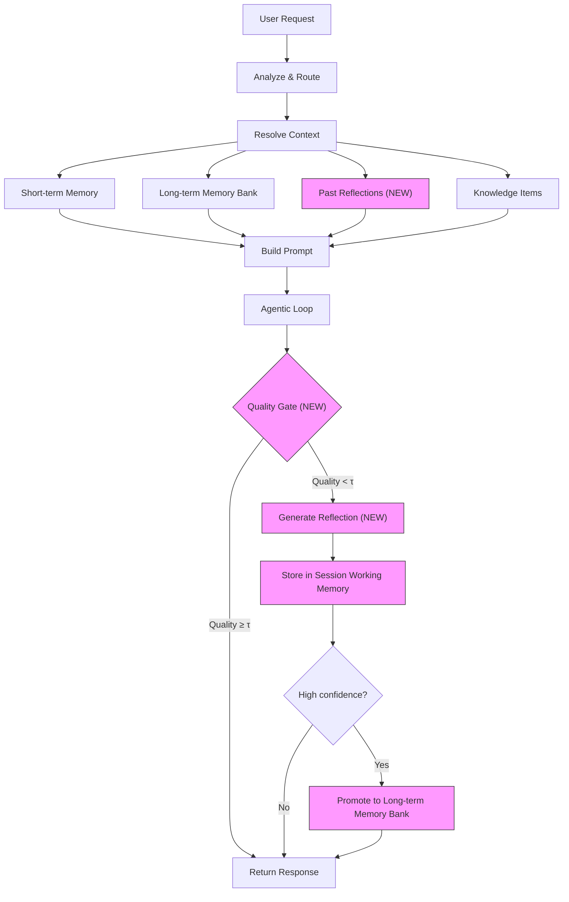

# Integrating ERL (Experiential Reinforcement Learning) into the Gestura Agent Workflow

## Background

**[Experiential Reinforcement Learning (ERL)](https://arxiv.org/html/2602.13949v1)** proposes a training paradigm with three core phases:

1. **Experience** — The agent makes an initial attempt and observes the outcome
2. **Reflection** — On suboptimal outcomes, the agent generates a structured reflection describing *what went wrong and how to improve*
3. **Consolidation** — Successful reflections are stored in a cross-episode memory and internalized into future behavior

The key insight we can adapt: **instead of treating failures as dead ends, transform them into structured corrective knowledge that improves future attempts** — both within the current session (short-term) and across sessions (long-term).

### How This Maps to Gestura's Existing Architecture

| ERL Concept | Gestura Equivalent | Status |
|---|---|---|
| Initial attempt | First agentic loop response | ✅ Exists |
| Environment feedback | Tool results, user corrections | ✅ Exists |
| Cross-episode memory | Long-term Memory Bank | ✅ Exists |
| Working memory | Short-term session working memory | ✅ Exists |
| Reflection generation | **NEW** — structured reflection step | ❌ To build |
| Gated reflection (τ threshold) | **NEW** — conditional reflection trigger | ❌ To build |
| Memory consolidation | **NEW** — reflection → memory bank promotion | ❌ To build |
| Internalization | **NEW** — inject past reflections into prompts | ❌ To build |

---

## User Review Required

> [!IMPORTANT]
> This plan introduces a **new phase** in the agent loop (reflection) that adds an extra LLM call on suboptimal outcomes. This has latency and cost implications. The design uses a **gated approach** (only trigger when quality signals are below threshold) to minimize overhead.

> [!WARNING]
> The reflection phase should be **opt-in** via configuration to avoid surprising users with extra latency. Default should be `disabled` initially until we validate the approach.

---

## Proposed Changes

### Component 1: Reflection Types & Memory

New types to represent structured reflections, extending the existing memory bank vocabulary.

#### [MODIFY] [memory_bank.rs](file:///Users/bc/Documents/gestura/code/gestura-app/crates/gestura-core-memory-bank/src/memory_bank.rs)

Add a new `MemoryType::Reflection` variant alongside the existing `Episodic`, `Semantic`, etc. This allows reflection entries to be stored, queried, and filtered using the existing memory bank infrastructure:

```diff
 pub enum MemoryType {
     Procedural,
     Semantic,
     Episodic,
     Resource,
     Decision,
     Blocker,
     Handoff,
+    /// Structured reflection from a failed/suboptimal agent attempt.
+    Reflection,
 }
```

Update `Display` and `FromStr` impls accordingly.

---

### Component 2: Reflection Data Structures

#### [NEW] [reflection.rs](file:///Users/bc/Documents/gestura/code/gestura-app/crates/gestura-core-pipeline/src/reflection.rs)

New module defining the ERL-inspired reflection types and logic:

```rust
/// Configuration for the experiential reflection system.
pub struct ReflectionConfig {
    /// Enable the reflection phase in the agent loop.
    pub enabled: bool,
    /// Quality threshold (0.0-1.0). Reflection only triggers when
    /// the agent's response quality score falls below this value.
    /// Maps to ERL's τ parameter (gated reflection).
    pub quality_threshold: f32,
    /// Maximum number of past reflections to inject into prompts.
    pub max_injected_reflections: usize,
    /// Minimum confidence for a reflection to be promoted to long-term memory.
    pub promotion_confidence: f32,
}

/// A structured reflection generated after a suboptimal agent turn.
pub struct AgentReflection {
    /// What the agent attempted
    pub attempt_summary: String,
    /// What went wrong or was suboptimal
    pub failure_analysis: String,
    /// Concrete corrective strategy for future attempts
    pub corrective_strategy: String,
    /// Quality improvement score (0.0-1.0) — did the reflection help?
    pub improvement_score: Option<f32>,
    /// Tags for retrieval (tool names, error categories, task types)
    pub tags: Vec<String>,
    /// Session context
    pub session_id: String,
    pub task_id: Option<String>,
    pub timestamp: chrono::DateTime<chrono::Utc>,
}
```

This module also contains:
- `build_reflection_prompt()` — constructs the prompt asking the LLM to reflect on a failed turn
- `parse_reflection_response()` — parses the structured reflection from LLM output
- `score_response_quality()` — heuristic quality scoring for gating (uses tool error rates, user corrections, request completeness)

---

### Component 3: Pipeline Integration

#### [MODIFY] [types.rs](file:///Users/bc/Documents/gestura/code/gestura-app/crates/gestura-core-pipeline/src/types.rs)

Add `ReflectionConfig` to [PipelineConfig](file:///Users/bc/Documents/gestura/code/gestura-app/crates/gestura-core-pipeline/src/types.rs#332-375):

```diff
 pub struct PipelineConfig {
     // ... existing fields ...
+    /// Configuration for ERL-inspired experiential reflection.
+    /// When enabled, the agent generates structured reflections on
+    /// suboptimal turns and stores them for future context injection.
+    pub reflection: ReflectionConfig,
 }
```

Default: `enabled: false`.

#### [MODIFY] [mod.rs](file:///Users/bc/Documents/gestura/code/gestura-app/crates/gestura-core/src/pipeline/mod.rs)

Add the reflection phase between the agentic loop completion and the PostPipeline hook:

```
                    Current Flow                          New Flow
                    ────────────                          ────────────
 1. Analyze request                          1. Analyze request
 2. Route/filter tools                       2. Route/filter tools
 3. Resolve context                          3. Resolve context
 ┌─ 3.1 Short-term working memory            ┌─ 3.1 Short-term working memory
 ├─ 3.2 Long-term memory bank                ├─ 3.2 Long-term memory bank
+│                                           ├─ 3.2.1 INJECT PAST REFLECTIONS ← NEW
 └─ 3.3 Knowledge items                      └─ 3.3 Knowledge items
 4. Build prompt                             4. Build prompt
 5. Execute agentic loop                     5. Execute agentic loop
+                                            6. QUALITY GATE CHECK ← NEW
+                                            6.1 IF below threshold:
+                                              6.1.1 Generate reflection (LLM call)
+                                              6.1.2 Store to session working memory
+                                              6.1.3 IF high-quality → promote to LT memory
 6. PostPipeline hooks                       7. PostPipeline hooks
```

The key integration points:

**A. Context Enrichment (step 3.2.1)** — In [enrich_resolved_context()](file:///Users/bc/Documents/gestura/code/gestura-app/crates/gestura-core/src/pipeline/mod.rs#1459-1507), query past reflections from memory bank (filtered by `MemoryType::Reflection`) and inject relevant ones into `resolved_context.memory_sections`:

```rust
// 3.2.1 Past reflections — inject if reflection system is enabled
if self.pipeline_config.reflection.enabled {
    if let Some(reflection_sections) = self
        .load_relevant_reflections(workspace_dir, metadata, query)
        .await
    {
        resolved_context.memory_sections.extend(reflection_sections);
    }
}
```

**B. Post-Loop Quality Gate (step 6)** — After [execute_agentic_loop_streaming()](file:///Users/bc/Documents/gestura/code/gestura-app/crates/gestura-core/src/pipeline/agent_loop.rs#4-391) returns, evaluate response quality. If below threshold, generate a reflection:

```rust
// 6. Experiential reflection (ERL-inspired)
if self.pipeline_config.reflection.enabled {
    let quality = score_response_quality(&response, &request);
    if quality < self.pipeline_config.reflection.quality_threshold {
        let reflection = self.generate_reflection(&request, &response, &tx).await?;
        self.store_reflection(reflection, workspace, &metadata).await;
    }
}
```

**C. New helper methods on [AgentPipeline](file:///Users/bc/Documents/gestura/code/gestura-app/crates/gestura-core/src/pipeline/mod.rs#64-84):**

- `load_relevant_reflections()` — queries memory bank for `MemoryType::Reflection` entries matching current context
- `generate_reflection()` — one extra LLM call with a reflection prompt
- `store_reflection()` — saves to session working memory + conditionally promotes to long-term memory bank
- `score_response_quality()` — heuristic scoring based on:
  - Tool error rate in the response
  - Number of iterations used (high = struggling)
  - Whether response was truncated
  - Presence of "I'm sorry, I can't" patterns

#### [MODIFY] [prompt.rs](file:///Users/bc/Documents/gestura/code/gestura-app/crates/gestura-core/src/pipeline/prompt.rs)

Add rendering for reflection context in [build_prompt()](file:///Users/bc/Documents/gestura/code/gestura-app/crates/gestura-core/src/pipeline/prompt.rs#4-132):

```diff
 // Add knowledge context
 if !context.knowledge.is_empty() { ... }

+// Add relevant past reflections
+if !context.reflection_sections.is_empty() {
+    prompt.push_str("Past reflections (learn from these):\n");
+    for section in context.reflection_sections.iter().take(3) {
+        prompt.push_str(section);
+        prompt.push('\n');
+    }
+}
```

---

### Component 4: Streaming Events

#### [MODIFY] [streaming types](file:///Users/bc/Documents/gestura/code/gestura-app/crates/gestura-core/src/streaming)

Add new `StreamChunk` variants so UIs can display reflection status:

```rust
StreamChunk::ReflectionStarted {
    reason: String,  // "Tool errors detected", "Low confidence response", etc.
},
StreamChunk::ReflectionComplete {
    summary: String,  // Brief summary of what was learned
    stored: bool,     // Whether it was saved to memory
    promoted: bool,   // Whether it was promoted to long-term memory
},
```

---

### Component 5: Configuration

#### [MODIFY] [config.rs](file:///Users/bc/Documents/gestura/code/gestura-app/crates/gestura-core/src/config.rs)

Expose reflection settings in `PipelineSettings` (YAML-configurable):

```yaml
pipeline:
  reflection:
    enabled: false          # Opt-in
    quality_threshold: 0.6  # Trigger reflection below this quality score
    max_injected: 3         # Max past reflections in prompt context
    promotion_confidence: 0.75  # Min confidence to promote to long-term
```

---

## Architecture Diagram



---

## Verification Plan

### Automated Tests

**Existing tests that must pass:**
```bash
# Full workspace test suite
cargo test --workspace --all-features

# Specific crate tests
cargo test -p gestura-core-memory-bank
cargo test -p gestura-core-pipeline
cargo test -p gestura-core -- pipeline::tests
```

**New tests to write:**

1. **Reflection type tests** in `gestura-core-pipeline/src/reflection.rs`:
   - `test_quality_scoring_high_quality_response` — verify good responses score above threshold
   - `test_quality_scoring_tool_errors` — verify responses with tool errors score low
   - `test_quality_scoring_many_iterations` — verify many iterations lowers score
   - `test_reflection_prompt_construction` — verify reflection prompt includes attempt context
   - `test_reflection_response_parsing` — verify structured reflection fields are extracted

2. **Memory type tests** in [gestura-core-memory-bank/src/memory_bank.rs](file:///Users/bc/Documents/gestura/code/gestura-app/crates/gestura-core-memory-bank/src/memory_bank.rs):
   - `test_reflection_memory_type_roundtrip` — verify `MemoryType::Reflection` serializes/deserializes
   - `test_reflection_query_filter` — verify memory queries can filter by `MemoryType::Reflection`

3. **Pipeline integration tests** in [gestura-core/src/pipeline/tests.rs](file:///Users/bc/Documents/gestura/code/gestura-app/crates/gestura-core/src/pipeline/tests.rs):
   - `test_reflection_disabled_by_default` — verify no reflection occurs with default config
   - `test_reflection_context_injection` — verify past reflections are injected into prompts when enabled

**Quality gates (must pass):**
```bash
cargo fmt
cargo clippy --workspace --all-targets --all-features -- -D warnings
```

### Manual Verification
The reflection system is internal and adds to the agent loop, so manual testing would involve:
1. Enable reflection in config.yaml
2. Trigger a request that causes a tool error
3. Verify that a reflection is generated (visible in logs and as a `StreamChunk::ReflectionComplete` event in the GUI)
4. Trigger a similar request and verify the past reflection appears in the prompt context

> [!NOTE]
> Since reflection adds an LLM call, we should ask the user to verify latency impact is acceptable in their typical workflows.
